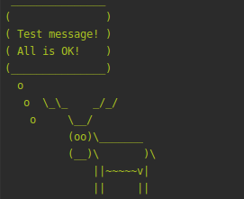

# artisan-moose
A Laravel package for moosing artisan info message.

## Installation
composer require riozzaki/artisan-moose

## Usage
```php
  use \Riozzaki\ArtisanMoose;
  
  $this->moose(['Message']);
```

## Example
```php
<?php
  
  namespace App\Console\Commands;
  
  use Illuminate\Console\Command;
  use Riozzaki\ArtisanMoose;
  
  class YourCommand extends Command
  {
      use ArtisanMoose;
  
      /**
       * The name and signature of the console command.
       *
       * @var string
       */
      protected $signature = 'moose:test';
  
      /**
       * Execute the console command.
       *
       * @return void
       */
      public function handle()
      {
          $this->moose([
              'Test message!',
              "All is OK!"
          ]);
      }
  }
```

## Result

